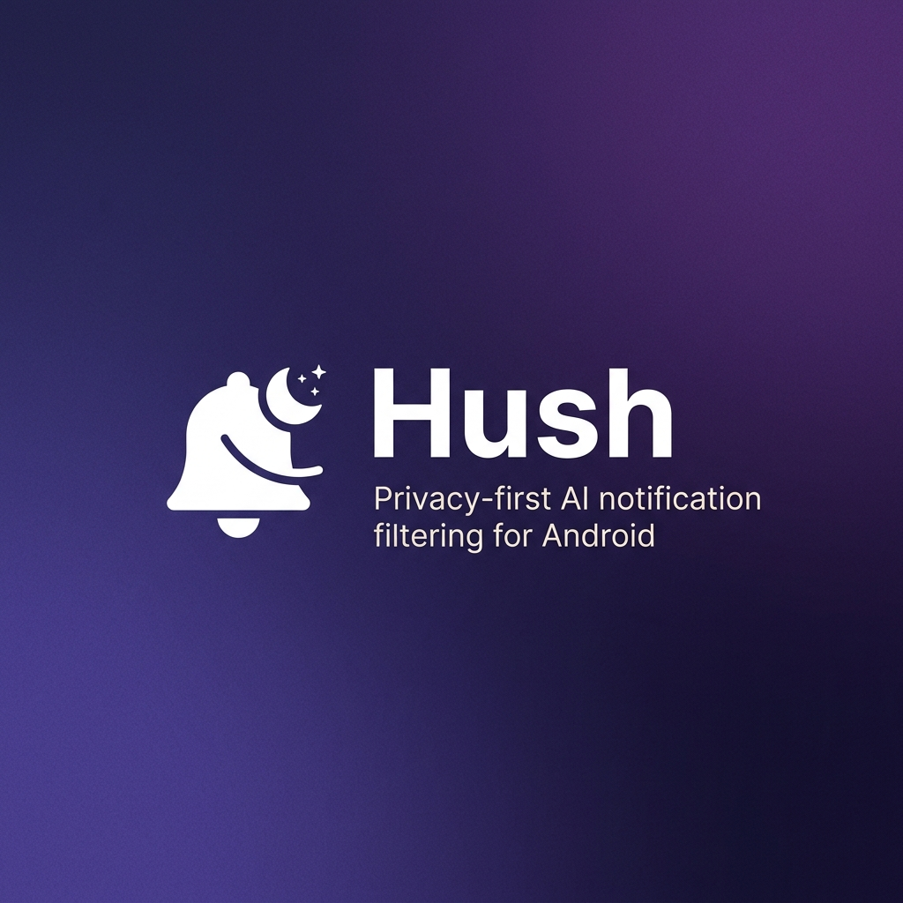
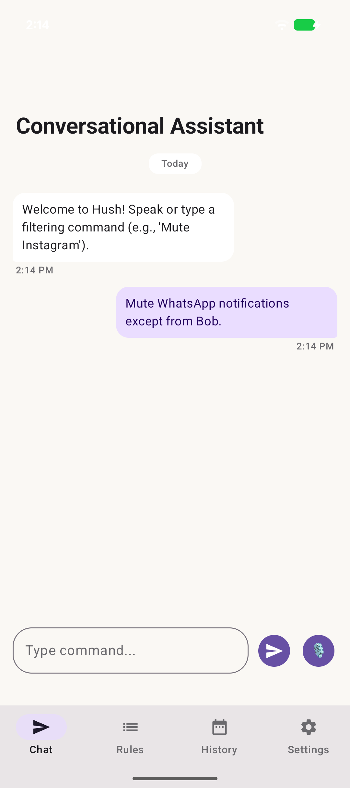
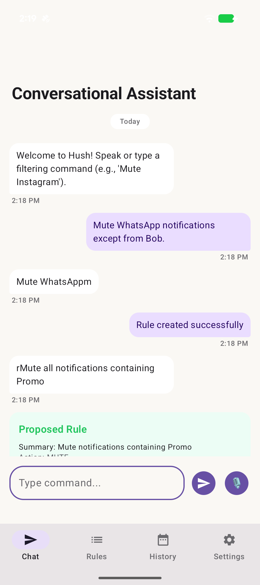
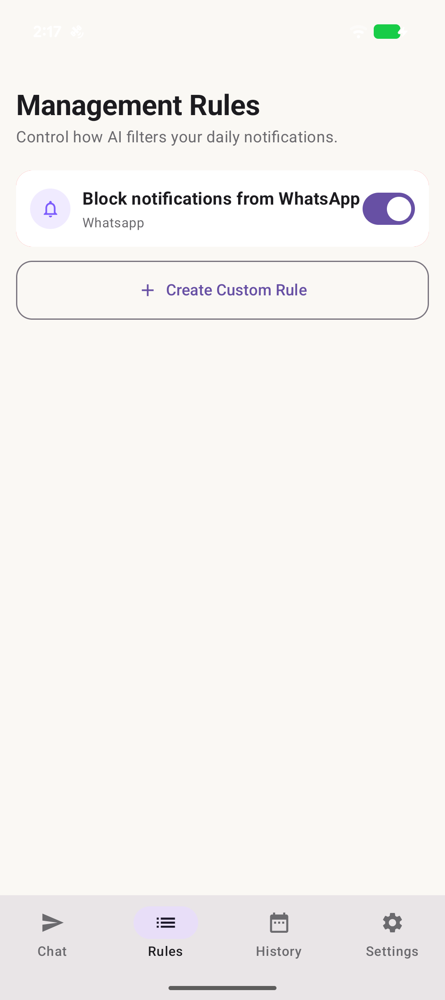
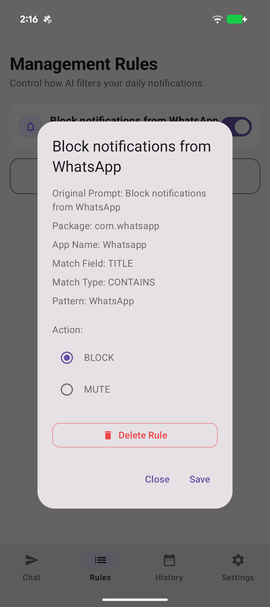
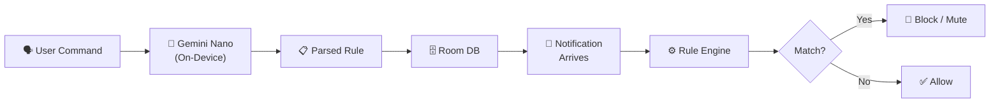

<p align="center">
  
</p>

<p align="center">
  <strong>Talk to your phone. Silence the noise.</strong>
</p>

<p align="center">
  <a href="#getting-started"></a>
  <a href="#getting-started"></a>
  <a href="#getting-started"></a>
  <a href="#tech-stack"></a>
  <a href="LICENSE"></a>
</p>

<p align="center">
  <a href="https://github.com/vssinghh/hush/stargazers"></a>
  <a href="https://github.com/vssinghh/hush/network/members"></a>
  <a href="https://github.com/vssinghh/hush/graphs/contributors"></a>
  <a href="https://github.com/vssinghh/hush/issues"></a>
</p>

---

Hush is a privacy-first notification filtering app for Android. Define rules in plain English — by typing or speaking — and Hush uses on-device AI (Gemini Nano) to parse your intent into structured rules that automatically block, mute, or allow notifications. Everything runs locally. No cloud. No data leaves your device.

<p align="center">
  <strong>⭐ Support the Project: If you find Hush useful or appreciate local AI privacy, please star this repository! It helps more developers discover the project. ⭐</strong>
</p>

---

## Screenshots

<p align="center">
  
  
  
  
</p>

<p align="center">
  <em>Chat · Rule Creation · Rules Management · Rule Detail</em>
</p>

---

## Features

### For Users

- 💬 **Natural language rules** — Say *"Mute WhatsApp notifications except from Bob"* and Hush creates the rule for you
- 🎙️ **Voice input** — Tap the mic and speak your command; a live waveform shows it's listening
- 🔕 **Three actions** — Block (dismiss), Mute (silence), or Allow notifications per rule
- 🔄 **Inverted logic** — Create exception-based rules like *"Block all from Gmail except @company.com"*
- ⏰ **Time windows** — Schedule rules to activate only during specific hours (e.g., 10 PM – 7 AM)
- 📋 **History log** — See every notification that was filtered and which rule triggered it
- 🧪 **Rule Tester** — Simulate notifications in Settings to verify rules work before going live
- 🔒 **Fully private** — No internet required. AI runs on-device via Gemini Nano through Google AICore

### For Developers

- 🧱 **Clean Architecture** — Domain, Data, and Presentation layers with clear dependency boundaries
- 💉 **Hilt DI** — Full dependency injection with modular Hilt modules
- 🗄️ **Room Database** — Type-safe persistence for rules and notification history
- 🎨 **Jetpack Compose** — Declarative UI with Material 3 / Material You dynamic theming
- 🤖 **On-device AI** — Gemini Nano integration via Google AI Client SDK for natural language parsing

---

## How It Works



1. **You speak or type** a filtering command in natural language
2. **Gemini Nano** (running locally via AICore) parses it into a structured rule
3. **The rule is stored** in a local Room database
4. **When a notification arrives**, the `NotificationListenerService` intercepts it
5. **The rule engine** evaluates it against all active rules (package, title, body, sender, time, inverted matches)
6. **Action is taken** — block, mute, or allow — and the result is logged to history

---

## Tech Stack

| Layer | Technology |
|-------|-----------|
| **Language** | Kotlin |
| **UI** | Jetpack Compose + Material 3 |
| **AI** | Gemini Nano via Google AICore |
| **Database** | Room (SQLite) |
| **DI** | Hilt / Dagger |
| **Architecture** | Clean Architecture (Domain → Data → UI) |
| **Speech** | Android SpeechRecognizer API |
| **Async** | Kotlin Coroutines + StateFlow |
| **Min SDK** | 33 (Android 13) |
| **Target SDK** | 35 (Android 15) |

---

## Getting Started

### 📲 Quick Install

If you are a user and just want to try out the app:
1. Head over to the **[Releases](https://github.com/vssinghh/hush/releases)** section.
2. Download the latest pre-compiled APK.
3. Install it on your Gemini Nano supported Android device.

### Prerequisites

- **JDK 17**
- **Android SDK Platform 35**
- A physical device with **Gemini Nano** support (Pixel 6 or newer recommended)
  - AICore must be installed and the Gemini Nano model downloaded on-device

### Build & Run

```bash
# Clone the repository
git clone https://github.com/vssinghh/hush.git
cd hush

# Build the debug APK
./gradlew assembleDebug

# Install on a connected device
./gradlew installDebug
```

### Dependency Resolution

Hush resolves dependencies from a local Maven repository (`repo/`) for reproducible offline builds:

<details>
<summary>View Gradle configuration</summary>

```kotlin
// settings.gradle.kts
dependencyResolutionManagement {
    repositoriesMode.set(RepositoriesMode.FAIL_ON_PROJECT_REPOS)
    repositories {
        maven { url = uri("${settingsDir}/repo") }
        google()
        mavenCentral()
    }
}
```

</details>

---

## Permissions

Hush requests the following Android permissions during onboarding:

| Permission | Required | Why |
|-----------|----------|-----|
| **Notification Listener** | ✅ Mandatory | Read and dismiss/mute incoming notifications |
| **Microphone** | Optional | Voice input for conversational rule creation |
| **Battery Optimization Exemption** | Optional | Keep the notification listener alive in the background |

> All permissions are explained in the onboarding flow and can be managed in system settings at any time.

---

## Architecture

Hush follows **Clean Architecture** principles with three layers:

```
┌─────────────────────────────────────────────┐
│  UI Layer (Jetpack Compose + ViewModels)    │
├─────────────────────────────────────────────┤
│  Domain Layer (Use Cases + Interfaces)      │
├─────────────────────────────────────────────┤
│  Data Layer (Room DB + AI Engine + Repos)   │
└─────────────────────────────────────────────┘
```

- **Domain** — Pure Kotlin. Models (`Rule`, `NotificationEvent`, `ParsedCommand`), repository interfaces, and use cases (`EvaluateNotificationUseCase`, `ParseCommandUseCase`). No Android dependencies.
- **Data** — Concrete implementations. Room database with DAOs and entities, `AIEngineImpl` (Gemini Nano), `SpeechRecognizerWrapperImpl`, and all repository implementations.
- **UI** — Jetpack Compose screens (Chat, Rules, History, Settings, Onboarding) with ViewModels exposing state via `StateFlow`.
- **Service** — `HushNotificationListener` bridges Android's `NotificationListenerService` with the domain layer.
- **DI** — Hilt modules wire everything together.

📖 **[Full package structure →](docs/ARCHITECTURE.md)**

---

## Testing

### Unit Tests

```bash
./gradlew testDebugUnitTest
```

| Test Class | Coverage |
|-----------|----------|
| `AIEngineImplTest` | JSON parsing, time format handling, input validation, error cases |
| `EvaluateNotificationUseCaseTest` | Rule matching: time windows, package filters, exact/regex/contains, inverted rules |
| `ParseCommandUseCaseTest` | End-to-end command parsing, package resolution, malformed input handling |
| `ChatViewModelTest` | State transitions, voice recording flow, rule confirmation/cancellation |

### Instrumented Tests (E2E)

```bash
./gradlew connectedAndroidTest
```

Runs on physical devices or emulators to verify full user flows, database persistence, and notification interception.

### Rule Tester (Manual)

The built-in **Rule Tester** in Settings lets you simulate notifications with custom app, title, body, and sender fields to verify rule matching without waiting for real notifications.

---

## Contributing

Contributions are welcome! Please:

1. Fork the repository
2. Create a feature branch (`git checkout -b feature/my-feature`)
3. Commit your changes (`git commit -m 'feat: add my feature'`)
4. Push to the branch (`git push origin feature/my-feature`)
5. Open a Pull Request

---

## License

```
Copyright 2025 Hush Contributors

Licensed under the Apache License, Version 2.0 (the "License");
you may not use this file except in compliance with the License.
You may obtain a copy of the License at

    http://www.apache.org/licenses/LICENSE-2.0

Unless required by applicable law or agreed to in writing, software
distributed under the License is distributed on an "AS IS" BASIS,
WITHOUT WARRANTIES OR CONDITIONS OF ANY KIND, either express or implied.
See the License for the specific language governing permissions and
limitations under the License.
```
