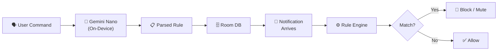

<p align="center">
  
</p>

<p align="center">
  <em>An Android app that lets you control notifications by talking to your phone.</em>
</p>

<p align="center">
  <a href="#getting-started"></a>
  <a href="#getting-started"></a>
  <a href="#getting-started"></a>
  <a href="#tech-stack"></a>
  <a href="LICENSE"></a>
</p>

<p align="center">
  <a href="https://github.com/vssinghh/hush/stargazers"></a>
  <a href="https://github.com/vssinghh/hush/network/members"></a>
  <a href="https://github.com/vssinghh/hush/graphs/contributors"></a>
  <a href="https://github.com/vssinghh/hush/issues"></a>
</p>

---

I built Hush because Android's notification settings are buried and rigid. With Hush you just type or say what you want — *"mute Slack after 10pm"* — and on-device AI (Gemini Nano) turns it into a real filtering rule. No cloud, no data leaves your phone. Everything runs locally through Google AICore.

---

## Screenshots

<p align="center">
  
  
  
  
</p>

<p align="center">
  <em>Chat · Rule Creation · Rules Management · Rule Detail</em>
</p>

---

## Features

- **Natural language rules.** Tell Hush *"Mute WhatsApp notifications except from Bob"* and it builds the rule for you.
- **Voice input.** Tap the mic, say what you want. A live waveform confirms it's listening.
- **Block, Mute, or Allow** — three actions per rule.
- **Inverted / exception rules.** *"Block all from Gmail except @company.com"* works exactly how you'd expect.
- **Time windows** so rules only fire during certain hours (e.g., 10 PM – 7 AM).
- Full **notification history** — see what got filtered and which rule matched.
- Built-in **Rule Tester** to simulate notifications before going live.
- **100% on-device.** No internet, no cloud. AI runs locally through Gemini Nano / AICore.

---

## How It Works



1. You type or say a filtering command in plain English.
2. Gemini Nano parses it into a structured rule (runs locally via AICore).
3. The rule gets saved to a Room database.
4. When a notification comes in, `NotificationListenerService` picks it up.
5. The rule engine checks it against active rules — package, title, body, sender, time, inverted matches.
6. Matched? Block or mute it. Not matched? Let it through. Either way, the result gets logged.

---

## Tech Stack

| Layer | Technology |
|-------|------------|
| **Language** | Kotlin |
| **UI** | Jetpack Compose + Material 3 |
| **AI** | Gemini Nano via Google AICore |
| **Database** | Room (SQLite) |
| **DI** | Hilt / Dagger |
| **Architecture** | Clean Architecture (Domain → Data → UI) |
| **Speech** | Android SpeechRecognizer API |
| **Async** | Kotlin Coroutines + StateFlow |
| **Min SDK** | 33 (Android 13) |
| **Target SDK** | 35 (Android 15) |

---

## Getting Started

### Quick Install

Just want to try the app?

1. Grab the latest APK from **[Releases](https://github.com/vssinghh/hush/releases)**.
2. Install it on a Gemini Nano supported Android device (Pixel 6+).

### Prerequisites

- **JDK 17**
- **Android SDK Platform 35**
- A physical device with **Gemini Nano** support (Pixel 6 or newer recommended)
  - AICore must be installed and the Gemini Nano model downloaded on-device

### Build & Run

```bash
# Clone the repository
git clone https://github.com/vssinghh/hush.git
cd hush

# Build the debug APK
./gradlew assembleDebug

# Install on a connected device
./gradlew installDebug
```

### Dependency Resolution

Hush ships a local Maven repository (`repo/`) so builds are reproducible and work offline.

<details>
<summary>View Gradle configuration</summary>

```kotlin
// settings.gradle.kts
dependencyResolutionManagement {
    repositoriesMode.set(RepositoriesMode.FAIL_ON_PROJECT_REPOS)
    repositories {
        maven { url = uri("${settingsDir}/repo") }
        google()
        mavenCentral()
    }
}
```

</details>

---

## Permissions

| Permission | Required | Why |
|-----------|----------|-----|
| **Notification Listener** | ✅ Mandatory | Read and dismiss/mute incoming notifications |
| **Microphone** | Optional | Voice input for creating rules |
| **Battery Optimization Exemption** | Optional | Keeps the notification listener alive in the background |

All permissions are explained during onboarding. You can change them in system settings at any time.

---

## Architecture

The app follows Clean Architecture with three layers:

```
┌─────────────────────────────────────────────┐
│  UI Layer (Jetpack Compose + ViewModels)    │
├─────────────────────────────────────────────┤
│  Domain Layer (Use Cases + Interfaces)      │
├─────────────────────────────────────────────┤
│  Data Layer (Room DB + AI Engine + Repos)   │
└─────────────────────────────────────────────┘
```

- **Domain** — Pure Kotlin. Models (`Rule`, `NotificationEvent`, `ParsedCommand`), repository interfaces, and use cases like `EvaluateNotificationUseCase`. No Android dependencies.
- **Data** — Room database, `AIEngineImpl` (wraps Gemini Nano), speech recognizer, and all the repo implementations.
- **UI** — Compose screens (Chat, Rules, History, Settings, Onboarding) backed by ViewModels with `StateFlow`.
- **Service** — `HushNotificationListener` hooks into Android's `NotificationListenerService`.
- **DI** — Hilt wires everything together.

📖 **[Full package structure →](docs/ARCHITECTURE.md)**

---

## Testing

### Unit Tests

```bash
./gradlew testDebugUnitTest
```

| Test Class | What it covers |
|-----------|------------|
| `AIEngineImplTest` | JSON parsing, time format handling, input validation, error cases |
| `EvaluateNotificationUseCaseTest` | Rule matching: time windows, package filters, exact/regex/contains, inverted rules |
| `ParseCommandUseCaseTest` | End-to-end command parsing, package resolution, malformed input handling |
| `ChatViewModelTest` | State transitions, voice recording flow, rule confirmation/cancellation |

### Instrumented Tests (E2E)

```bash
./gradlew connectedAndroidTest
```

Runs on a physical device or emulator. Covers user flows, database persistence, and notification interception.

### Rule Tester (Manual)

There's a built-in Rule Tester under Settings. You can plug in a custom app name, title, body, and sender to see which rules would match — no need to wait for a real notification.

---

## Contributing

Contributions are welcome! Here's the usual flow:

1. Fork the repo
2. Create a feature branch (`git checkout -b feature/my-feature`)
3. Commit your changes (`git commit -m 'feat: add my feature'`)
4. Push to the branch (`git push origin feature/my-feature`)
5. Open a Pull Request

---

## License

```
Copyright 2025 Hush Contributors

Licensed under the Apache License, Version 2.0 (the "License");
you may not use this file except in compliance with the License.
You may obtain a copy of the License at

    http://www.apache.org/licenses/LICENSE-2.0

Unless required by applicable law or agreed to in writing, software
distributed under the License is distributed on an "AS IS" BASIS,
WITHOUT WARRANTIES OR CONDITIONS OF ANY KIND, either express or implied.
See the License for the specific language governing permissions and
limitations under the License.
```
