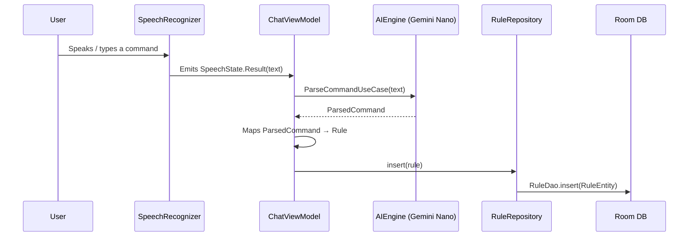
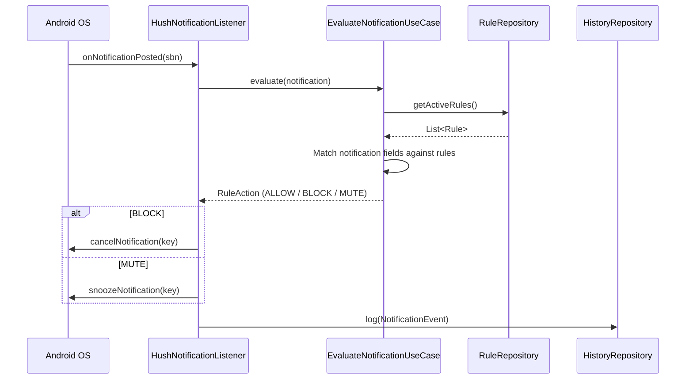

# Hush — Architecture Overview

## Clean Architecture Principles

Hush follows **Clean Architecture** to keep the codebase modular, testable, and maintainable. The core idea is a strict dependency rule: inner layers know nothing about outer layers.

| Layer | Responsibility | Key Constraint |
|-------|---------------|----------------|
| **Domain** | Business logic, models, use cases, repository interfaces | Pure Kotlin — no Android or framework imports |
| **Data** | Concrete implementations of domain interfaces (Room, SharedPreferences, Gemini Nano) | Depends on Domain; never on UI |
| **Service** | Android platform services (NotificationListenerService) | Depends on Domain; thin adapter to the OS |
| **UI** | Jetpack Compose screens, ViewModels, navigation | Depends on Domain; observes state, delegates actions |
| **DI** | Hilt modules that wire everything together | References all layers; the only place cross-layer wiring occurs |

> [!NOTE]
> The **domain** layer is intentionally free of Android dependencies so that business rules can be unit-tested without Robolectric or an emulator.

---

## Package Structure

```
com.hush.app/
│
├── di/                     # Dependency Injection modules (Hilt)
│   ├── AIModule.kt         # Binds AIEngine
│   ├── DatabaseModule.kt   # Provides Room Database, RuleDao, and NotificationLogDao instances
│   ├── PermissionModule.kt # Binds PermissionManager
│   ├── PreferencesModule.kt# Provides OnboardingPrefs
│   └── RepositoryModule.kt # Binds Repository implementations
│
├── domain/                 # Business Logic & Core Interfaces (Pure Kotlin)
│   ├── model/              # Domain models and enums
│   │   ├── Rule.kt         # Rule data class, RuleAction, MatchField, MatchType enums
│   │   ├── NotificationEvent.kt # Notification log data class
│   │   └── ParsedCommand.kt # AI-parsed command representation
│   ├── permission/         # Permission-related interfaces
│   │   └── PermissionManager.kt
│   ├── repository/         # Repository interfaces & State definitions
│   │   ├── AIEngine.kt
│   │   ├── HistoryRepository.kt
│   │   ├── PackageResolver.kt
│   │   ├── RuleRepository.kt
│   │   ├── SpeechRecognizerWrapper.kt
│   │   └── SpeechState.kt  # Sealed interface representing speech input states
│   └── usecase/            # Use cases encapsulating business logic
│       ├── EvaluateNotificationUseCase.kt # Matches notifications against active rules
│       └── ParseCommandUseCase.kt         # Feeds natural language prompt to AIEngine
│
├── data/                   # Data Access & Concrete Implementations
│   ├── db/                 # Room DB Setup
│   │   ├── HushDatabase.kt
│   │   └── RoomConverters.kt
│   │   ├── dao/            # Room DAOs
│   │   │   ├── NotificationLogDao.kt
│   │   │   └── RuleDao.kt
│   │   └── entity/         # Room Entities
│   │       ├── NotificationLogEntity.kt
│   │       └── RuleEntity.kt
│   ├── pref/               # SharedPreferences
│   │   └── OnboardingPrefs.kt
│   └── repository/         # Data Repositories & Engine Implementations
│       ├── AIEngineImpl.kt # Implements AIEngine via Google AI Client (Gemini Nano)
│       ├── HistoryRepositoryImpl.kt
│       ├── PackageResolverImpl.kt
│       ├── PermissionManagerImpl.kt
│       ├── PromptTemplates.kt
│       ├── RuleRepositoryImpl.kt
│       └── SpeechRecognizerWrapperImpl.kt # Implements SpeechRecognizerWrapper using Android Speech APIs
│
├── service/                # Android Services
│   └── HushNotificationListener.kt # Intercepts notifications using NotificationListenerService
│
└── ui/                     # Presentation Layer (Jetpack Compose UI)
    ├── navigation/         # NavGraph and Routes
    │   ├── HushNavigation.kt
    │   └── ScreenRoute.kt
    ├── screens/            # UI Screens & ViewModels
    │   ├── MainScreen.kt
    │   ├── chat/           # Conversational Chat Screen
    │   │   ├── ChatScreen.kt
    │   │   └── ChatViewModel.kt
    │   ├── history/        # History Logs Screen
    │   │   ├── HistoryScreen.kt
    │   │   └── HistoryViewModel.kt
    │   ├── onboarding/     # Onboarding Setup Screen
    │   │   ├── OnboardingScreen.kt
    │   │   └── OnboardingViewModel.kt
    │   ├── rules/          # Rules List & Details Screen
    │   │   ├── RulesScreen.kt
    │   │   └── RulesViewModel.kt
    │   └── settings/       # Settings/Preferences Screen
    │       ├── SettingsScreen.kt
    │       └── SettingsViewModel.kt
    └── theme/              # Material 3 Theming
        ├── Color.kt
        ├── Theme.kt
        └── Type.kt
```

---

## Layer Descriptions

### `domain/` — Business Logic & Core Interfaces

The innermost layer. It contains **pure Kotlin** models, enums, repository interfaces, and use cases. Nothing here imports Android or any third-party framework. This makes the domain fully unit-testable and reusable.

- **`model/`** — Data classes (`Rule`, `NotificationEvent`, `ParsedCommand`) and enums (`RuleAction`, `MatchField`, `MatchType`) that represent core business concepts.
- **`permission/`** — `PermissionManager` interface abstracting Android permission checks so the domain can reason about permission state without touching the framework.
- **`repository/`** — Interfaces (`RuleRepository`, `HistoryRepository`, `AIEngine`, `PackageResolver`, `SpeechRecognizerWrapper`) and the `SpeechState` sealed interface. Concrete implementations live in `data/`.
- **`usecase/`** — Single-responsibility use cases:
  - `EvaluateNotificationUseCase` — matches an incoming notification against every active rule and returns the action (ALLOW / BLOCK / MUTE).
  - `ParseCommandUseCase` — sends a natural-language prompt to the `AIEngine` and returns a structured `ParsedCommand`.

### `data/` — Data Access & Concrete Implementations

Implements everything the domain declares as an interface.

- **`db/`** — Room database setup (`HushDatabase`, `RoomConverters`), DAOs (`RuleDao`, `NotificationLogDao`), and entities (`RuleEntity`, `NotificationLogEntity`) that map to SQLite tables.
- **`pref/`** — `OnboardingPrefs` wraps `SharedPreferences` for lightweight key-value storage (e.g., whether the user has completed onboarding).
- **`repository/`** — Concrete implementations:
  - `AIEngineImpl` — calls **Gemini Nano** on-device via the Google AI Client SDK.
  - `SpeechRecognizerWrapperImpl` — wraps Android's `SpeechRecognizer` API and exposes results as `SpeechState` emissions.
  - `RuleRepositoryImpl` / `HistoryRepositoryImpl` — CRUD operations backed by Room.
  - `PackageResolverImpl` — resolves package names to human-readable app labels.
  - `PermissionManagerImpl` — checks and requests runtime permissions.
  - `PromptTemplates` — stores the prompt strings sent to Gemini Nano.

### `service/` — Android Services

Contains `HushNotificationListener`, a subclass of `NotificationListenerService`. This is the app's entry point for intercepting system notifications. It delegates evaluation logic to `EvaluateNotificationUseCase` and logs every decision to `HistoryRepository`.

### `ui/` — Presentation Layer

Built entirely with **Jetpack Compose** and follows the unidirectional data-flow pattern (state flows down, events flow up).

- **`navigation/`** — `HushNavigation` defines the `NavHost` graph; `ScreenRoute` is a sealed class / enum of all destinations.
- **`screens/`** — Each feature has a `*Screen.kt` (composable) and a `*ViewModel.kt` (state holder):
  - **Chat** — conversational interface for creating rules via voice or text.
  - **Rules** — lists all rules with swipe-to-delete and toggle-to-enable.
  - **History** — scrollable log of past notification decisions.
  - **Onboarding** — guides the user through required permissions and initial setup.
  - **Settings** — app preferences and permission management.
- **`theme/`** — Material 3 `Color`, `Typography`, and `Theme` definitions.

### `di/` — Dependency Injection (Hilt)

Hilt modules that live at the app's outermost boundary and wire interfaces to implementations:

| Module | What it provides / binds |
|--------|--------------------------|
| `AIModule` | Binds `AIEngine` → `AIEngineImpl` |
| `DatabaseModule` | Provides `HushDatabase`, `RuleDao`, `NotificationLogDao` |
| `PermissionModule` | Binds `PermissionManager` → `PermissionManagerImpl` |
| `PreferencesModule` | Provides `OnboardingPrefs` |
| `RepositoryModule` | Binds `RuleRepository`, `HistoryRepository`, etc. to their `*Impl` counterparts |

---

## Key Data Flows

### 1. Rule Creation Flow



**Step-by-step:**

1. The user speaks or types a natural-language command (e.g., *"Mute all Slack notifications after 10 PM"*).
2. `SpeechRecognizerWrapper` captures the audio, converts it to text, and emits a `SpeechState.Result`.
3. `ChatViewModel` passes the text to `ParseCommandUseCase`, which forwards it to `AIEngine`.
4. `AIEngineImpl` sends the prompt (with `PromptTemplates`) to **Gemini Nano** running on-device and returns a structured `ParsedCommand`.
5. The ViewModel maps the `ParsedCommand` into a `Rule` domain model.
6. The rule is persisted via `RuleRepository` → `RuleDao` → Room / SQLite.

### 2. Notification Evaluation Flow



**Step-by-step:**

1. Android delivers a notification to `HushNotificationListener` via `onNotificationPosted`.
2. The listener extracts relevant fields (app package, title, text) and passes them to `EvaluateNotificationUseCase`.
3. The use case fetches all active rules from `RuleRepository`.
4. Each rule's `MatchField` + `MatchType` criteria are tested against the notification.
5. The first matching rule's `RuleAction` is returned:
   - **ALLOW** — notification passes through untouched.
   - **BLOCK** — notification is cancelled immediately.
   - **MUTE** — notification is snoozed / silenced.
6. The decision is logged as a `NotificationEvent` in `HistoryRepository` for the History screen.
